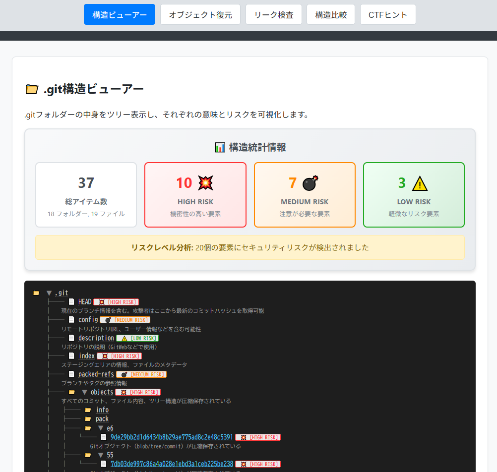

# Git Secrets Playground


**Day031 - 生成AIで作るセキュリティツール100**

「`.git`ディレクトリーが外部に公開されたとき、何が漏れるのか？」

**Git Secrets Playground** はその疑似体験を通じて、Gitリポジトリの構造とセキュリティリスクを学ぶ教育用シミュレーターです。

本ツールは、以下のような目的で設計されています。

- `.git`ディレクトリー構造の可視化
- Gitオブジェクト（blob / tree / commit）の内容復元体験
- `.git`公開による情報漏洩リスクのシミュレーション
- CTFなどで頻出するGit漏洩系問題への予習・復習

※すべて**クライアントサイドで完結**する安全なシミュレーションです。実際に外部へアクセスしたり、悪用したりすることはありません。

---

## 🧪 主な機能

| モード | 機能概要 |
|--------|-----------|
| 🗂️ 構造ビューアー | `.git/`配下の代表的なファイル・ディレクトリーと、その役割・漏洩リスクを可視化 |
| 🧩 オブジェクト復元 | `objects/`ディレクトリー内の Gitオブジェクト（ハッシュ）を復元して表示 |
| 🚨 リーク検査 | `.git/HEAD` などが公開されている場合のリスクを再現的にシミュレーション（※実アクセスなし） |

---

## 🖥️ デモページ

👉 [https://ipusiron.github.io/git-secrets-playground/](https://ipusiron.github.io/git-secrets-playground/)

---

## 📸 スクリーンショット

>
>
>*ダミー*

---

## 📁 フォルダー構成

```
git-secrets-playground/
├── index.html
├── style.css
├── script.js
├── data/
│ └── sample_git_structure.json
├── assets/
│ └── (アイコンや図解画像など)
└── README.md
```

---

## 📚 学べること

- `.git/`ディレクトリーの内部構造
- Gitオブジェクト（blob / tree / commit）の役割と復元方法
- 公開サーバーに`.git`が残っていた場合の被害シナリオ
- CTFなどで使われる`.git`リーク問題の典型手法

---

## ⚠️ 免責事項

本ツールは**教育目的**で提供されています。  
実際のWebサイトに対して`.git`ディレクトリーへのアクセスを試みるなど、**無断での検査・利用は絶対におやめください**。

---

## 📄 ライセンス

MIT License - 詳細は[LICENSE](LICENSE)をご覧ください。

---

## 🛠 このツールについて

本ツールは、「生成AIで作るセキュリティツール100」プロジェクトの一環として開発されました。
このプロジェクトでは、AIの支援を活用しながら、セキュリティに関連するさまざまなツールを100日間にわたり制作・公開していく取り組みを行っています。

プロジェクトの詳細や他のツールについては、以下のページをご覧ください。

🔗 [https://akademeia.info/?page_id=42163](https://akademeia.info/?page_id=42163)
