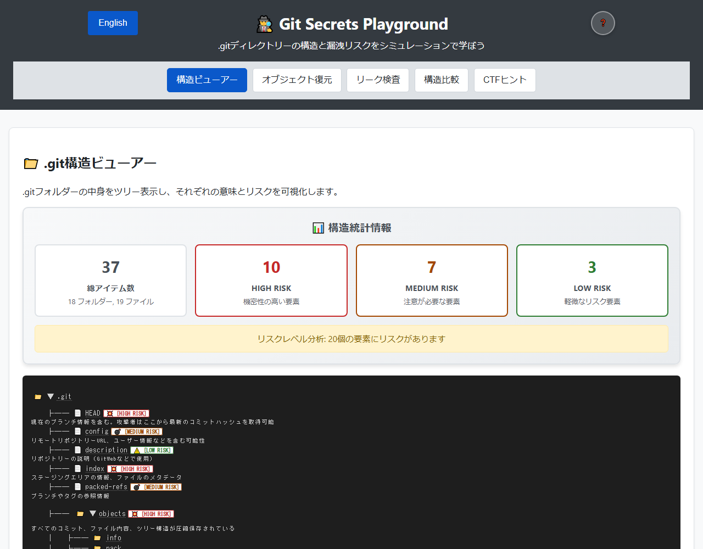
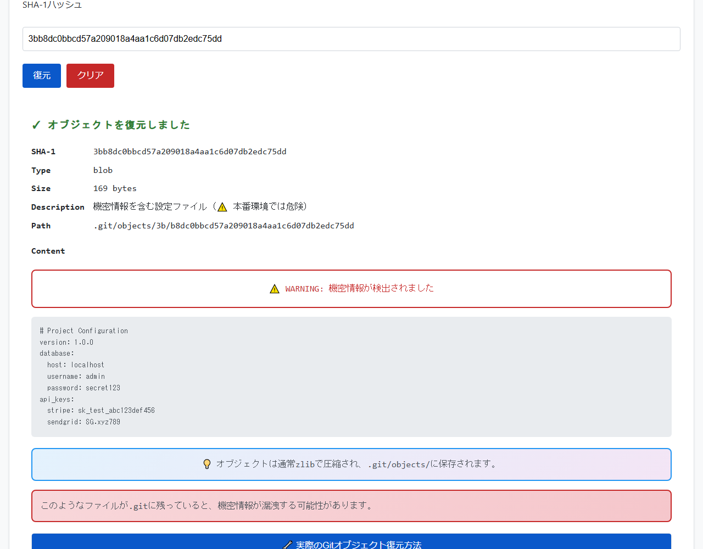
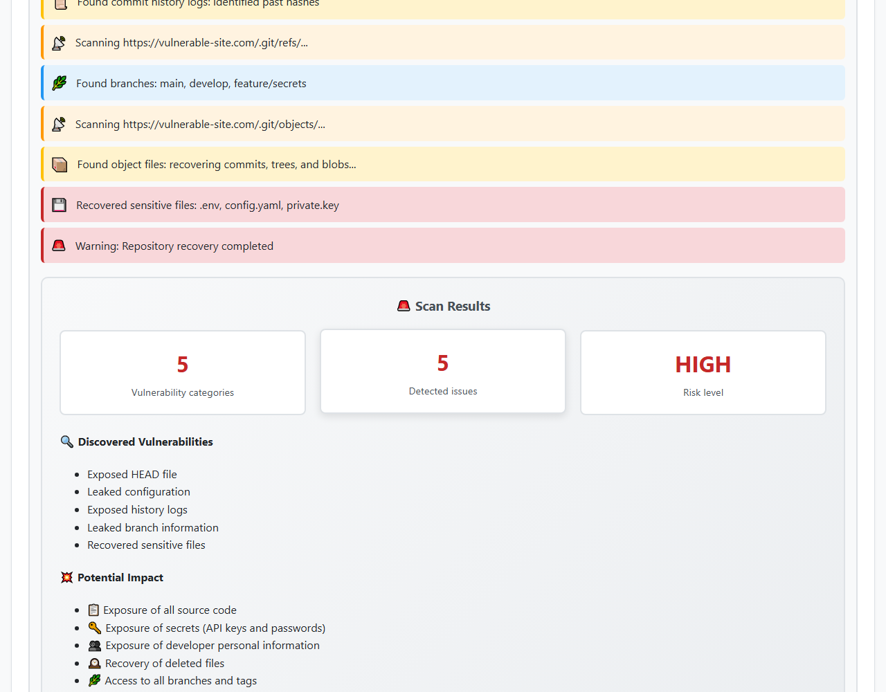

<!--
---
id: day031
slug: git-secrets-playground

title: "Git Secrets Playground"

subtitle_ja: "Git情報漏洩シミュレーター"
subtitle_en: "Git Information Leak Simulator"

description_ja: ".gitディレクトリーが外部に公開された際の情報漏洩リスクを疑似体験できる教育用シミュレーター。構造ビューアー、オブジェクト復元、リーク検査、構造比較、CTFヒントの5つのモードを搭載。"
description_en: "An educational simulator that demonstrates the security risks when .git directories are exposed. Features 5 modes: Structure Viewer, Object Recovery, Leak Inspector, Structure Compare, and CTF Hints."

category_ja:
  - フォレンジック
  - 情報漏洩対策
category_en:
  - Forensics
  - Information Leak Prevention

difficulty: 3

tags:
  - git
  - security
  - education
  - simulation
  - ctf

repo_url: "https://github.com/ipusiron/git-secrets-playground"
demo_url: "https://ipusiron.github.io/git-secrets-playground/"

hub: true
---
-->

English: [README.en.md](README.en.md)

# Git Secrets Playground - Git情報漏洩シミュレーター


[](https://ipusiron.github.io/git-secrets-playground/)

**Day031 - 生成AIで作るセキュリティツール100**

「`.git`ディレクトリーが外部に公開されたとき、何が漏れるのか？」

**Git Secrets Playground**はその疑似体験を通じて、Gitリポジトリーの構造とセキュリティリスクを学ぶ教育用シミュレーターです。日本語・英語に対応し、5つのタブをfile://でも利用できます。

## 🌐 デモページ

👉 [https://ipusiron.github.io/git-secrets-playground/](https://ipusiron.github.io/git-secrets-playground/)

---

## 📸 スクリーンショット



*日本語の統計とツリー先頭のリスク色分け（1280×1000、114,140バイト）。*



*日本語の設定ファイル復元。ハッシュ3bb8dc0b…・169バイト・中身を表示（1280×1000、92,900バイト）。*



*英語でスキップ完了したリーク検査の結果（1280×1000、234,199バイト）。*

---

## ✨ 機能

### 🗂️ 構造ビューアー
- **ツリー表示**: `.git`ディレクトリーの階層構造を視覚的に表示
- **リスクレベル表示**: 各ファイルのセキュリティリスク（HIGH/MEDIUM/LOW）を色分け
- **展開/折りたたみ**: フォルダーをクリックして内容の表示・非表示切り替え
- **ハッシュ値コピー**: ハッシュファイルをクリックしてクリップボードにコピー
- **ツールチップ**: ファイル名にホバーして詳細情報を表示
- **統計情報**: リスクレベル別の要素数とファイル・フォルダー数を集計表示

### 🔍 オブジェクト復元（シミュレーション）
- **サンプルボタン**: 4種類のハッシュ値（空ファイル、テキスト、機密設定、Docker）を一発入力
- **手動入力**: 40桁のSHA-1ハッシュを入力し、既知の4種類のblobだけを復元
- **復元結果表示**: オブジェクトタイプ、サイズ、内容を詳細表示
- **教育情報**: zlibによる圧縮やGitオブジェクトの仕組みを解説

### 🚨 リーク検査（シミュレーション）
- **URL入力**: 検査対象URLの設定（プリセットボタンも利用可能）
- **検査オプション**: `.git/HEAD`、`config`、`logs/HEAD`、`refs/`、`objects/`を選択可能
- **速度調整**: 1x（標準）、2x（高速）、4x（超高速）から選択
- **制御機能**:
  - ⏸️ **一時停止/再開**: スキャン途中での停止・再開
  - ⏭️ **スキップ**: 結果をすぐに表示
  - 📊 **プログレスバー**: 進行状況をリアルタイム表示
- **結果表示**: 発見された脆弱性の詳細分析とリスクサマリー

### ⚖️ 構造比較
- **プリセット比較**:
  - 🛡️ セキュアな設定 vs ⚠️ 危険な設定
  - 🔒 プライベートリポジトリー vs パブリックリポジトリー
  - 🔧 開発環境 vs 本番環境
- **並列表示**: 2つの構造を左右に並べて視覚的に比較
- **比較分析表**: リスクレベル別の要素数を数値で比較
- **推奨事項**: セキュリティ向上のための具体的なアドバイス

### 🚩 CTFヒント
- **基本調査手順**: `.git`ディレクトリー発見から情報収集までの手順
- **便利ツール**: GitHacker、git-dumper、Wayback Machineの使い方
- **出題パターン**:
  - 🔑 削除されたフラグファイル
  - 🌿 別ブランチのフラグ
  - 📝 コミットメッセージのヒント
  - 🗂️ 設定ファイルの機密情報
- **実践テクニック**: コマンドライン操作のコツとベストプラクティス

### ❓ ヘルプシステム
- **包括的ドキュメント**: 全機能の詳細説明とFAQ
- **スクロール対応**: 長いコンテンツに対応した縦スクロール機能
- **複数の閉じ方**: ✕ボタン、ESCキー、オーバーレイクリック
- **レスポンシブ対応**: デスクトップ・モバイル両方に最適化

### 🌐 日英切り替えとキーボード操作

- ヘッダーの言語ボタンで切り替え。タブ・開閉・復元・スキャン・比較の状態を保持
- 言語の優先順位は`?lang=ja|en`、保存値、ブラウザーの言語の順
- タブは左右キー・Home・End、各操作はTabとEnterまたはSpaceで選択
- ヘルプ内でTabが循環し、Escで閉じると元のボタンにフォーカスが戻る
- 44px以上の操作領域、320px幅対応、動きを減らす設定への対応

---

## 📖 使い方

### 📦 セットアップ

1. **リポジトリーのクローン**
   ```bash
   git clone https://github.com/ipusiron/git-secrets-playground.git
   cd git-secrets-playground
   ```

2. **直接開くかHTTPで配信**

   `index.html`をブラウザーで開くだけで動きます（file://対応）。HTTPで使う場合は次を実行し、`http://localhost:8000`を開きます。

   ```bash
   python -m http.server 8000
   ```

### 🎮 基本操作

1. **❓ ヘルプボタン**: ツール名右側の❓ボタンで全機能の詳細説明を表示
2. **タブ切り替え**: 上部のタブボタンで5つの機能を切り替え
3. **📁 構造ビューアー**: フォルダーをクリックして展開/折りたたみ
4. **🚨 リーク検査**: URL入力後、速度を選択してスキャン実行
5. **⚖️ 構造比較**: プリセットボタンで異なる環境を比較

### 💡 よくある質問

**Q: ローカルサーバーは必要ですか？**

A: 不要です。構造データは同梱のJavaScriptから読み込むため、file://でも5タブすべてが動きます。

**Q: リーク検査で実際にWebサイトにアクセスしますか？**
A: いいえ。完全にシミュレーションです。実際の外部アクセスは一切行いません。

**Q: スマートフォンでも使用できますか？**
A: はい。レスポンシブデザインによりモバイルデバイスでも最適表示されます。

**Q: ヘルプボタンが反応しません**
A: ブラウザーのコンソール（F12）を確認してJavaScriptエラーがないかチェックしてください。

---

## 🔬 仕様と既知解答

Gitのblobのハッシュは、UTF-8の中身の前に`blob <バイト数>\0`を付けたバイト列のSHA-1です。たとえば`blobHeader(12)`の16進数は`626c6f6220313200`です。ルーズオブジェクトはハッシュの先頭2桁をフォルダー、残り38桁をファイル名にします。

| 説明 | ハッシュ | サイズ（バイト） | 置き場所 |
|---|---|---|---|
| 空ファイル（.gitkeepなど） | `e69de29bb2d1d6434b8b29ae775ad8c2e48c5391` | 0 | `.git/objects/e6/9de29bb2d1d6434b8b29ae775ad8c2e48c5391` |
| テキストファイル（Hello Worldと改行） | `557db03de997c86a4a028e1ebd3a1ceb225be238` | 12 | `.git/objects/55/7db03de997c86a4a028e1ebd3a1ceb225be238` |
| 機密情報を含む設定ファイル | `3bb8dc0bbcd57a209018a4aa1c6d07db2edc75dd` | 169 | `.git/objects/3b/b8dc0bbcd57a209018a4aa1c6d07db2edc75dd` |
| Dockerfile | `df799688ee42b4d33e495ffa1a78469753c7dde9` | 263 | `.git/objects/df/799688ee42b4d33e495ffa1a78469753c7dde9` |

以前の設定ファイルは空のtreeのハッシュ`4b825dc642cb6eb9a060e54bf8d69288fbee4904`と誤った156バイトを使っていました。Dockerfileの旧ハッシュ`89e6c98cbe0ffaa2f1ce9e8c19ca7ee4ad51eb42`と298バイトも誤りだったため、どちらも中身から再計算した上表の値へ訂正しました。空のtreeのハッシュ自体は`tree 0\0`のSHA-1として正しい値です。

ツリーは37項目（ファイル19・フォルダー18）で、HIGHが10、MEDIUMが7、LOWが3です。サンプルの中身は変更していません。

復元は4種類の固定blobを引くシミュレーションです。画面上で本物のSHA-1計算・zlib解凍や任意のリポジトリーの復元は行わず、リーク検査も入力URLへ通信しません。数値はテストでNodeの暗号機能から再計算します。

---

## 🔒 Gitセキュリティベストプラクティス

### 🛡️ 予防対策

**1. .gitディレクトリーの公開防止**
```apache
# Apache (.htaccess)
<DirectoryMatch "^/.*/\.git/">
    Require all denied
</DirectoryMatch>

# Nginx
location ~ /\.git {
    deny all;
    return 403;
}
```

**2. 機密情報のコミット防止**
```bash
# .gitignoreに機密ファイルを追加
echo "*.env" >> .gitignore
echo "config/secrets.yml" >> .gitignore
echo "*.key" >> .gitignore
echo ".env.*" >> .gitignore

# git-secretsツールを使用
git secrets --install
git secrets --register-aws
```

**3. pre-commitフックの活用**
```bash
# 機密情報検出用フック設定
pip install pre-commit
echo "repos:" > .pre-commit-config.yaml
echo "  - repo: https://github.com/Yelp/detect-secrets" >> .pre-commit-config.yaml
echo "    hooks:" >> .pre-commit-config.yaml
echo "      - id: detect-secrets" >> .pre-commit-config.yaml
```

### 🚨 事後対応

まず漏洩した認証情報を失効・再発行し、影響を調べます。次の履歴変更の例は、バックアップと関係者との調整を済ませた管理対象でのみ実施してください。履歴の変更だけでは漏洩済みの情報を回収できません。

**1. すでにコミットしてしまった機密情報の削除**
```bash
# git filter-branchで履歴から完全削除
git filter-branch --force --index-filter \
'git rm --cached --ignore-unmatch secret-file.txt' \
--prune-empty --tag-name-filter cat -- --all

# または、BFG Repo-Cleanerを使用
java -jar bfg.jar --delete-files secret-file.txt
git reflog expire --expire=now --all
git gc --prune=now --aggressive
```

**2. リモートリポジトリーの強制更新**
```bash
# 全ブランチを強制プッシュ
git push origin --force --all
git push origin --force --tags
```

### 📋 定期チェック項目

- [ ] Webサーバーで`.git`ディレクトリーへのアクセスが拒否されている
- [ ] .gitignoreが適切に設定されている
- [ ] 機密情報検出ツールが導入されている
- [ ] 開発者への`.git`漏洩リスク教育が実施されている
- [ ] 本番環境に`.git`ディレクトリーが存在しない

### 🔍 `.git/logs/HEAD`ファイルについて

`.git/logs/HEAD`はGit内部でコミット履歴の移動（HEADの変遷）を記録するログファイルです。

次の内容を含みます。
- HEADの移動履歴（checkout・commit・rebase・resetなど）
- 各移動時の前のコミットハッシュ → 新しいコミットハッシュ
- 実行者の名前・メールアドレス・日時・アクション内容

公開されていれば、過去の変更履歴や削除されたフラグが完全復元される可能性があります。

| 状況                  | 影響度                       |
| ------------------- | ------------------------- |
| `.git/HEAD` 公開      | 中リスク（構成が漏れる）              |
| `.git/logs/HEAD` 公開 | **高リスク**（過去の秘密情報まで復元されうる） |

### 🕵️ 検出方法（Google Dork例）

```
site:example.com inurl:.git
site:example.com filetype:git
intitle:"Index of" .git
inurl:.git/HEAD
inurl:.git/config
"[core]" "repositoryformatversion" site:example.com
```

**注意**: これらのDorkは教育目的でのみ使用し、無断でのスキャンは絶対に行わないでください。

---

## 📚 学べること

- `.git/`ディレクトリーの内部構造と各ファイルの役割
- Gitオブジェクト（blob / tree / commit）の仕組みと復元方法
- 公開サーバーに`.git`が残っていた場合の具体的な被害シナリオ
- CTF競技で頻出するGit漏洩問題の典型的な解法パターン
- セキュリティ対策の実装方法（予防・検出・事後対応）

---

## 🔗 関連リソース

### 自作ツール

- [Dork Watcher](https://ipusiron.github.io/dork-watcher/)
    - `site:example.com inurl:.git`というDorkに対応。

### Walkthrough

- [GitRoot:1 攻略 Walkthrough【VulnHub編】](https://akademeia.info/?p=27143)

---

## 🔒 このツールのセキュリティ

画面はDOM APIと`textContent`で組み立て、HTML文字列の挿入・インラインハンドラー・style属性を使いません。meta CSPは次の値です。

```text
default-src 'self'; script-src 'self'; style-src 'self'; img-src 'self' data:; object-src 'none'; base-uri 'none'; form-action 'none'
```

外部API・CDN・フォント・依存パッケージは使いません。アプリから外部ホストへの通信はなく、外部資料のリンクは利用者が開く場合に限ります。localStorageは言語を保存する`gitsecrets-language`だけに使い、読み書きが遮断されても操作できます。READMEのバッジはGitHub上で表示する外部画像で、アプリの通信には含みません。

---

## ⚠️ 免責事項

本ツールは**教育目的**で提供されています。
実際のWebサイトに対して`.git`ディレクトリーへのアクセスを試みるなど、**無断での検査・利用は絶対におやめください**。

---

## 🧪 テスト

```bash
npm test
```

依存パッケージのインストールは不要です。GitHub Actionsではpushとpull_requestの両方でNode22を使います。

| ファイル | 検査 |
|---|---|
| core.test.js | 本物のblobのSHA-1・UTF-8サイズ・置き場所・集計・URL |
| i18n.test.js | 辞書のキー・空値・使用キー・日本語の直書き |
| html.test.js | CSP・ARIA・ラベル・外部リンク・禁止API |
| contrast.test.js | 指定色の文字コントラスト4.5:1以上 |
| format.test.js | 行数の下限と行の長さ |
| readme.test.js | 日英の既知解答・YAML・ファイルツリー・見出し・画像 |

サンプルの中身が変わっていないことは、元のコミット`bbecd38`のソースとも比較します。浅いクローンの場合は、その履歴を取得してから実行してください。

---

## 📁 ディレクトリー構造

```
git-secrets-playground/           # プロジェクトルート
├── .github/                      # GitHubの設定
│   └── workflows/                # GitHub Actionsのワークフロー
│       └── test.yml              # pushとpull_requestでNode22のnpm testを実行
├── .gitignore                    # Git管理から.claude/を除外
├── .nojekyll                     # GitHub PagesのJekyll処理を無効化
├── CLAUDE.md                     # 構成・規則・テストの開発ガイド
├── LICENSE                       # MITライセンス
├── README.md                     # 日本語の使い方・仕様・既知解答・テスト
├── README.en.md                  # 同じ節構成の英語版README
├── package.json                  # 依存なしのnpm test（node --test）
├── index.html                    # 5タブ・ヘルプ・meta CSP
├── style.css                     # 配色変数・レスポンシブ・アニメーション
├── assets/                       # README用の画像
│   ├── screenshot.png            # 構造ビューアーの統計とリスクの色分け
│   ├── screenshot2.png           # 機密設定ファイルのサンプル復元
│   └── screenshot3.png           # 英語のリーク検査の結果
├── js/                           # file://でも動くclassic script
│   ├── git-core.js               # ハッシュ・置き場所・集計・URLの純粋関数
│   ├── git-data.js               # .git構造と正しいハッシュのサンプル
│   ├── app.js                    # 5タブ・スキャン・比較・ヘルプの処理
│   └── i18n.js                   # 日英の辞書・ヘルプ・CTFヒント・切り替え
└── test/                         # node --testによる自動テスト
    ├── core.test.js              # 中核・データ・サンプルのSHA-1再計算
    ├── i18n.test.js              # 辞書のキーと日本語の直書きの検査
    ├── html.test.js              # CSP・ARIA・DOM APIの静的検査
    ├── contrast.test.js          # 配色のコントラスト4.5:1以上
    ├── format.test.js            # 最長行と行数でminifyを検出
    └── readme.test.js            # 既知解答・YAML・構造・見出し・画像
```

---

## 💻 動作環境

JavaScriptを有効にした現行のChrome・Edge・Firefox・Safari向けです。file://とローカルHTTPの両方で動き、ビルドやサーバー側の処理は不要です。自動テストにはNode22、ブラウザー確認には既存のPython版Playwright＋Chromiumを使っています。

---

## 📄 ライセンス

MIT License - 詳細は[LICENSE](LICENSE)をご覧ください。

---

## 🛠️ このツールについて

本ツールは、「生成AIで作るセキュリティツール100」プロジェクトの一環として開発されました。
このプロジェクトでは、AIの支援を活用しながら、セキュリティに関連するさまざまなツールを100日間にわたり制作・公開していく取り組みを行っています。

プロジェクトの詳細や他のツールについては、以下のページをご覧ください。

🔗 [https://akademeia.info/?page_id=42163](https://akademeia.info/?page_id=42163)
